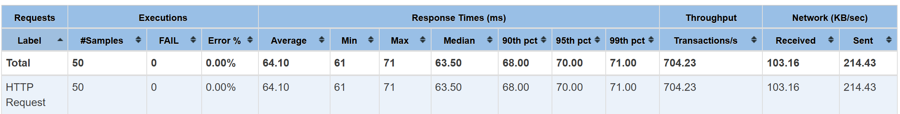

# Financial Transaction Service

- [Financial Transaction Service](#financial-transaction-service)
  - [Requirements](#requirements)
  - [Architecture](#architecture)
  - [How to Build and Run locally](#how-to-build-and-run-locally)
  - [How to Deploy on EKS:](#how-to-deploy-on-eks)
  - [API Documentation](#api-documentation)
    - [POST /api/accounts/{accountNumber}/balance](#post-apiaccountsaccountnumberbalance)
      - [Example:](#example)
      - [Response:](#response)
    - [POST /api/transactions/transfer](#post-apitransactionstransfer)
      - [Response:](#response-1)
      - [Response:](#response-2)
  - [Unit \& Integration Test](#unit--integration-test)
  - [Mock account and transaction data](#mock-account-and-transaction-data)
  - [Resilience Test](#resilience-test)
    - [Senario 1: Pod restart](#senario-1-pod-restart)
    - [Senario 2: Node failure](#senario-2-node-failure)
    - [Senario 3: Horizontal Pod Autoscaler](#senario-3-horizontal-pod-autoscaler)
  - [Performance Test](#performance-test)
    - [Senario 1: Concurrent transfer without involving same account](#senario-1-concurrent-transfer-without-involving-same-account)
    - [Senario 2: Concurrent transfer with involving same account](#senario-2-concurrent-transfer-with-involving-same-account)
  - [TODO](#todo)


## Requirements

- OpenJDK 21.0.4
- Maven (3.8.7)
- Docker
- Kubernetes (AWS EKS)
- AWS ElastiCache Redis OSS (for caching)
- AWS RDS PostgreSQL (for database)

## Architecture


## How to Build and Run locally

1. Clone the repository:
```bash
git clone git@github.com:hbfjk/hsbcdemo1.git
cd hsbcdemo1
```

2. Build the project

Before run below command, make sure the postgresql database and redis server are setup properly which is specified in spring.redis and spring.datasrouce section src\main\resources\application.yml, create a hsbcdemo schema in the database.
```
mvn clean install
```
Or build the project with skipping test
```
mvn clean install -Dmaven.test.skip=true
```

3. Run the application locally:
```
mvn spring-boot:run
```

4. Run the application in the docker
```
mvn package
docker build -t transaction-service .
docker run -d -p 8081:8081 transaction-service
```
To run the docker connecting to AWS services, run below command with `-e SPRING_PROFILES_ACTIVE=default,prod`, make sure spring.redis and spring.datasrouce section are updated in src\main\resources\application`-prod`.yml in the build stage.
```
docker run -d -e SPRING_PROFILES_ACTIVE=default,prod -p 8081:8081 transaction-service
```

## How to Deploy on EKS:
1. Setup prerequisites:

- Set up AWS RDS PostgreSQL server，create a hsbcdemo schema in the database.
- Set up AWS ElastiCache Redis OSS
- Create an EKS cluster with 3 worker nodes, use the free t2.micro node type can reduce the cost.
- Push docker image to docker hub
```
docker login --username hbfjk
docker tag transaction-service hbfjk/transaction-service
docker push hbfjk/transaction-service
```

2. Connect to AWS EKS cluster:
- Create an IAM user in AWS console, with proper EKS cluster access permissions.
- Login with `aws configure` command, specifying AWS access key ID, AWS secret Access Key, Default region name(ap-southeast-2), Default output format(json)
```
aws configure
```
- Writing kubeconfig file with eksctl command
```
eksctl utils write-kubeconfig --region ap-southeast-2 --cluster test-cluster
```
- Verify kubectl works
```
> kubectl get node
NAME                                               STATUS   ROLES    AGE   VERSION
ip-172-31-11-97.ap-southeast-2.compute.internal    Ready    <none>   12h   v1.31.3-eks-59bf375
ip-172-31-35-223.ap-southeast-2.compute.internal   Ready    <none>   14h   v1.31.3-eks-59bf375
```
3. Deploy transaction application on EKS:

Replace `<user_name>` and `<user_password>` with your docker hub credentials
```
kubectl create secret docker-registry transaction-service-pull-secret \
  --docker-server=https://index.docker.io/v1/ \
  --docker-username=<user_name> \
  --docker-password=<user_password>

kubectl apply -f kubernetes/serviceaccount.yaml
kubectl apply -f kubernetes/deployment.yaml
kubectl apply -f kubernetes/service.yaml
kubectl apply -f kubernetes/hpa.yaml
```
4. Verify deployment:

- Verify 2 initial transaction service pods in ready state.
```
> kubectl get pod
NAME                                   READY   STATUS    RESTARTS   AGE
transaction-service-5597f5f775-69k8c   1/1     Running   0          65s
transaction-service-5597f5f775-zhm4r   1/1     Running   0          65s
```
- Verify service is associated with an external load banlancer with is specified in EXTERNAL-IP field.
```
> kubectl get svc
NAME                  TYPE           CLUSTER-IP       EXTERNAL-IP                                                                   PORT(S)        AGE
kubernetes            ClusterIP      10.100.0.1       <none>                                                                        443/TCP        3h15m
transaction-service   LoadBalancer   10.100.103.110   a46eba48ca66142aca515e9403848a3e-624959006.ap-southeast-2.elb.amazonaws.com   80:31909/TCP   7m25s
```
- Verify transaction service
```
curl http://a46eba48ca66142aca515e9403848a3e-624959006.ap-southeast-2.elb.amazonaws.com/actuator/health
```
It should return below response:
```
{"status":"UP","groups":["liveness","readiness"]}
```

## API Documentation
### POST /api/accounts/{accountNumber}/balance
- accountNumber: account number

#### Example:

```
curl -X GET http://localhost:8080/api/accounts/123456/balance
```

#### Response:

- 200 OK: 500.00
- 400 Bad Request: Account not found: 123456

### POST /api/transactions/transfer
- sourceAccountNumber: Source account number
- destinationAccountNumber: Destination account number
- amount: Amount to transfer

#### Response:

```
curl -X POST 'http://localhost:8081/api/transactions/transfer?sourceAccountNumber=12345&destinationAccountNumber=54321&amount=50'
```

#### Response:

- 200 OK: Transaction processed successfully
- 400 Bad Request: Transaction failed (e.g., insufficient funds)

## Unit & Integration Test
Run the unit tests with:
```
mvn clean test
```
The coverage report can be found in target/site/jacoco/index.html:


## Mock account and transaction data
- Run below command to create 400 accounts(:mock-account-${n}) and 200 transactions between accounts randomly
```
curl --request POST '<load_balance_url>/api/mocks/mock?accountNumber=400&transactionNumber=200'

for i in {0..399}; do  balance=$(curl --silent --request GET "<load_balance_url>/api/accounts/mock-account-$i/balance");  echo "Account mock-account-$i balance：$balance"; done
```
- Verify mocked data

Verify above command return result like below:
```
Mock finished successfully
Account mock-account-0 balance：5000.00
Account mock-account-1 balance：5000.00
Account mock-account-2 balance：5000.00
Account mock-account-3 balance：5000.00
......
Account mock-account-399 balance：5000.00
```
Verify Redis have cache keys for the 400 accounts
```
> SCAN 0 MATCH accountCache:* COUNT 1000
1) "0"
2) 1) "accountCache::mock-account-237"
   2) "accountCache::mock-account-257"
   3) "accountCache::mock-account-349"
   4) "accountCache::mock-account-235"
......
   400) "accountCache::mock-account-15"
```

## Resilience Test
### Senario 1: Pod restart
1. Start below script, continue to sent request to query account balance.
```
#!/bin/bash
URL="localhost:8081/api/accounts/12345/balance"
while true; do
  echo "$(date '+%Y-%m-%d %H:%M:%S') Sending request to $URL"
  RESPONSE=$(curl --silent --location "$URL")
  echo "Response: $RESPONSE"
  sleep 0.5
done
```
2. Force Pod Restart, delete one pod.
```
kubectl delete pod <pod-name>
```
3. Verified that pod can be recreated, and request eventually get to the new pod, by querying log:
```
Hibernate: select a1_0.account_number,a1_0.balance from hsbcdemo.account a1_0 where a1_0.account_number=?
```

### Senario 2: Node failure
1. Start below script, continue to sent request to query account balance.
```
#!/bin/bash
URL="localhost:8081/api/accounts/12345/balance"
while true; do
  echo "$(date '+%Y-%m-%d %H:%M:%S') Sending request to $URL"
  RESPONSE=$(curl --silent --location "$URL")
  echo "Response: $RESPONSE"
  sleep 0.5
done
```
2. Force shutdown one node.

Using below command to get one transaction service pod hostIP
```
kubectl get pod transaction-service-5597f5f775-ljkxh -o jsonpath='{.status.hostIP}'
172.31.11.97
```
On the AWS EC2 instance console, find the instance associated with the hostIP, then stop the instance.

3. Verified that new Pod initiated on another health node and request eventually get to the new pod, by querying log:
```
Hibernate: select a1_0.account_number,a1_0.balance from hsbcdemo.account a1_0 where a1_0.account_number=?
```

### Senario 3: Horizontal Pod Autoscaler
TODO: Verify that HPA works

## Performance Test
### Senario 1: Concurrent transfer without involving same account

1. Run below command to simulate 50 concurrent user, to transfer 10 from mock-acocunt-<< n >> to mock-account-<< n+1 >>
```
jmeter -n -t .\jmeter-jmxs\No-Concurrent-Transfer.jmx -l .\jmeter-jmxs\No-Concurrent-Transfer.jtl -Dservername=<loadbancer_url> -Dserverport=80 -Jhttp.timeout=5000
```
2. Generate report from jtl file:
```
jmeter -g .\jmeter-jmxs\No-Concurrent-Transfer.jtl -o .\jmeter-jmxs\No-Concurrent-Transfer
```
3. Check the database with the account balance with first 100 accounts.
4. Check jmeter-jmxs\No-Concurrent-Transfer\index.html for the report:



### Senario 2: Concurrent transfer with involving same account
1. Run below command to simulate 50 concurrent user, to transfer 10 from mock-acocunt-<< 1 to 50 >> to mock-account-0
```
jmeter -n -t .\jmeter-jmxs\Transfer-To-Same-Account.jmx -l .\jmeter-jmxs\Transfer-To-Same-Account.jtl -Dservername=<loadbancer_url> -Dserverport=80 -Jhttp.timeout=5000
```
2. Generate report from jtl file:
```
jmeter -g .\jmeter-jmxs\Transfer-To-Same-Account.jtl -o .\jmeter-jmxs\Transfer-To-Same-Account
```
3. Check the database with the account balance with first 51 accounts.
4. Check jmeter-jmxs\Transfer-To-Same-Account\index.html for the report:


## TODO
- Expose database and redis connection parameters as environment variable.
- Enable https secure port
- Provide front account search and transfer UI
- Reduce server startup time, currently 30s+
